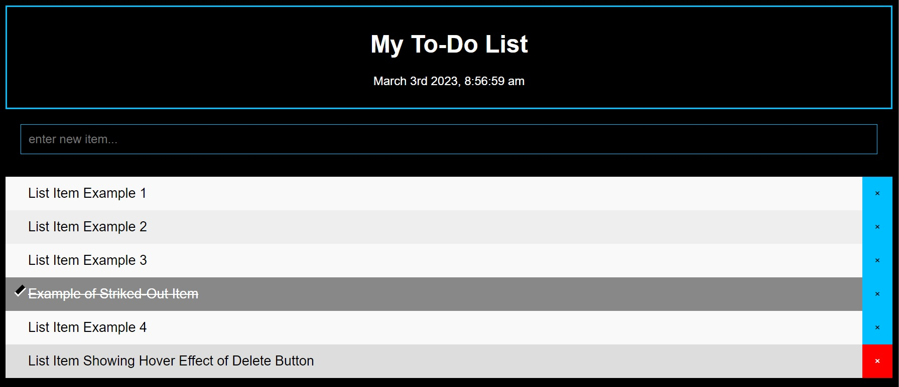

# Jax To-Do

https://jaxpi.github.io/Jax-To-Do/
  
  

## Description

This is a simple to-do list creator application that allows users to create, store, and delete list items in an easy to use layout with user-friendly formatting.

## Usage

Users type their new items/tasks in the bar beneath the date and time. Upon clicking enter the item will be added to their list and a button will be created for deleting it. Clicking on the item once will strike the item out but not delete it so the user can still see it until they are ready to delete it permanently.

## Future

Features to be added in the future are:
-calendar button to optionally set a deadline
-click and drag to rearrange items
-double click items to edit them
-color code items orange the day before their deadline and move above other items
-color code items red the day of the deadline (and beyond) and move above other items
-split input boxes to have one bolded title box and one content box
-fix the appearance of the checkmark and maintain strike-out effect upon refresh
-make app installable as a PWA for use on desktop and mobile devices

## License

MIT License

Copyright (c) 2022 Jackson Impellizeri

Permission is hereby granted, free of charge, to any person obtaining a copy
of this software and associated documentation files (the "Software"), to deal
in the Software without restriction, including without limitation the rights
to use, copy, modify, merge, publish, distribute, sublicense, and/or sell
copies of the Software, and to permit persons to whom the Software is
furnished to do so, subject to the following conditions:

The above copyright notice and this permission notice shall be included in all
copies or substantial portions of the Software.

THE SOFTWARE IS PROVIDED "AS IS", WITHOUT WARRANTY OF ANY KIND, EXPRESS OR
IMPLIED, INCLUDING BUT NOT LIMITED TO THE WARRANTIES OF MERCHANTABILITY,
FITNESS FOR A PARTICULAR PURPOSE AND NONINFRINGEMENT. IN NO EVENT SHALL THE
AUTHORS OR COPYRIGHT HOLDERS BE LIABLE FOR ANY CLAIM, DAMAGES OR OTHER
LIABILITY, WHETHER IN AN ACTION OF CONTRACT, TORT OR OTHERWISE, ARISING FROM,
OUT OF OR IN CONNECTION WITH THE SOFTWARE OR THE USE OR OTHER DEALINGS IN THE
SOFTWARE.
